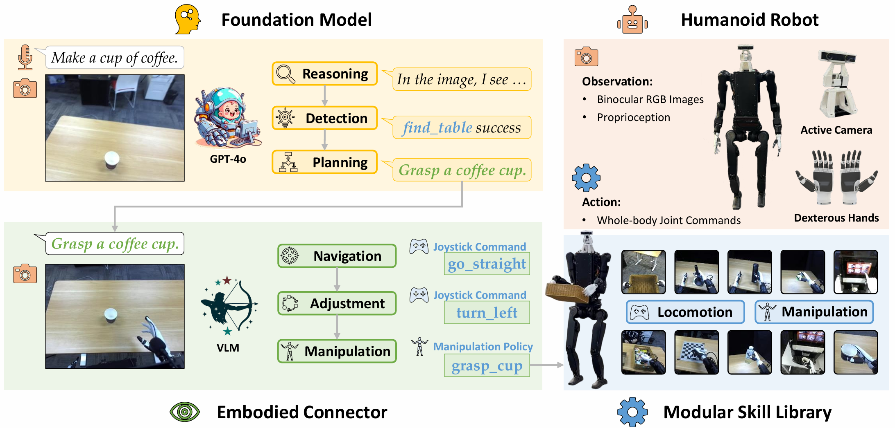

# Being-0: A Humanoid Robotic Agent with Vision-Language Models and Modular Skills

<div align="center">

[[Website]](https://beingbeyond.github.io/being-0)
[[arXiv]](https://arxiv.org/abs/2503.12533)

[]()
[]()



</div>

Our agent framework, Being-0, effectively controls a full-sized humanoid robot equipped with dexterous hands and active vision to solve complex, long-horizon embodied tasks in real-world environments. Videos can be found on our [[Website]](https://beingbeyond.github.io/being-0).


## Code
We will release our code soon.

## Citation
If you find our work useful, please consider citing us!
```
@article{yuan2025being,
    title={Being-0: A Humanoid Robotic Agent with Vision-Language Models and Modular Skills},
    author={Yuan, Haoqi and Bai, Yu and Fu, Yuhui and Zhou, Bohan and Feng, Yicheng and Xu, Xinrun and Zhan, Yi and Karlsson, B{\"o}rje F and Lu, Zongqing},
    journal={arXiv preprint arXiv:2503.12533},
    year={2025}
}
```
